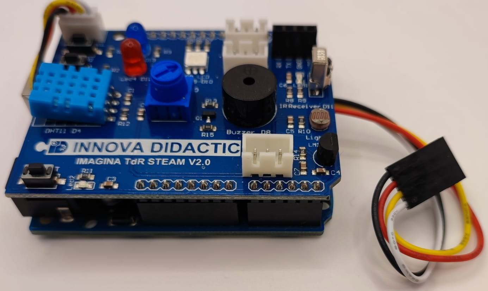

# Caja contenedor imprimible 3D
## Partes
La caja está compuesta de una base, una tapa, tres tornillos y un destornillador. La base con indicación de donde va a ir cada elemento la vemos en la imagen siguiente:

| Base o caja |
|:|
|  |

El aspecto de la tapa lo tenemos en la imagen siguiente, donde podemos observar el orificio estriado que servirá para colocar el destornillador cuando finalicemos el montaje.

| Tapa |
|:|
|  |

Finalmente en la imagen siguiente podemos ver el aspecto de uno de los tres tornillos que sujetan la tapa a la caja y el del destornillador.

| Tornillo y destornillador |
|:|
|  |

## Archivos stl listos para descargar e imprimir

* Archivo STL de la caja: [caja.stl](caja-TdR-STEAM/caja.stl)
* Archivo STL de la tapa: [tapa.stl](caja-TdR-STEAM/tapa.stl) 
* Archivo STL del tornillo: [tornillo.stl](caja-TdR-STEAM/tornillo.stl) 
* Archivo STL del destornillador: [destornillador.stl](caja-TdR-STEAM/destornillador.stl) 
* Todos los archivos en un zip: [caja-TdR-STEAM.zip](caja-TdR-STEAM/caja-TdR-STEAM.zip) 

## Pasos de montaje

* **Paso 1**. Colocamos la TdR STEAM sobre la placa UNO pasando el cable de cuatro hilos entre ambas y colocando el conector JST de 4 pines en la TdR STEAM (este conector solamente entra en una posición) para obtener algo similar a la imagen siguiente:

| Montaje de la TdR STEAM sobre UNO conectando el I2C |
|:|
|  |

* **Paso 2**. Conectamos la LCD mediante el conector plano de 4 pines asegurando que el cable negro va al pin marcado como GND. Hay que tener precaución con la orientación de este conector pues es reversible. El resultado debe ser similar al siguiente:

| Montaje de la LCD |
|:|
|  |

* **Paso 3**. En la imagen siguiente se ven los elementos anteriores colocados en su lugar.

| Montaje de Shield+UNO y LCD en la base |
|:|
|  |

* **Paso 4**. Conectamos un cable de tres hilos al micrófono teniendo en cuenta que el cable negro va al terminal marcado con una G y el otro extremo del cable lo colocamos en el conector JST de 3 pines marcado con A3. Pasamos los cables por debajo de la LCD y el resultado será algo similar a lo siguiente:

| Montaje de micrófono |
|:|
|  |

* **Paso 5**. Colocamos el teclado en su lugar.

| Colocación del mando a distancia |
|:|
|  |

* **Paso 6**. Finalmente colocamos la tapa y atornillamos cada tornillo en su tuerca, los apretamos con ayuda del destornillador y colocamos este en su alojamiento. Tendremos finalizada la colocación de elementos en la caja, tal y como vemos a continuación:

| Montaje finalizado |
|:|
|  |

