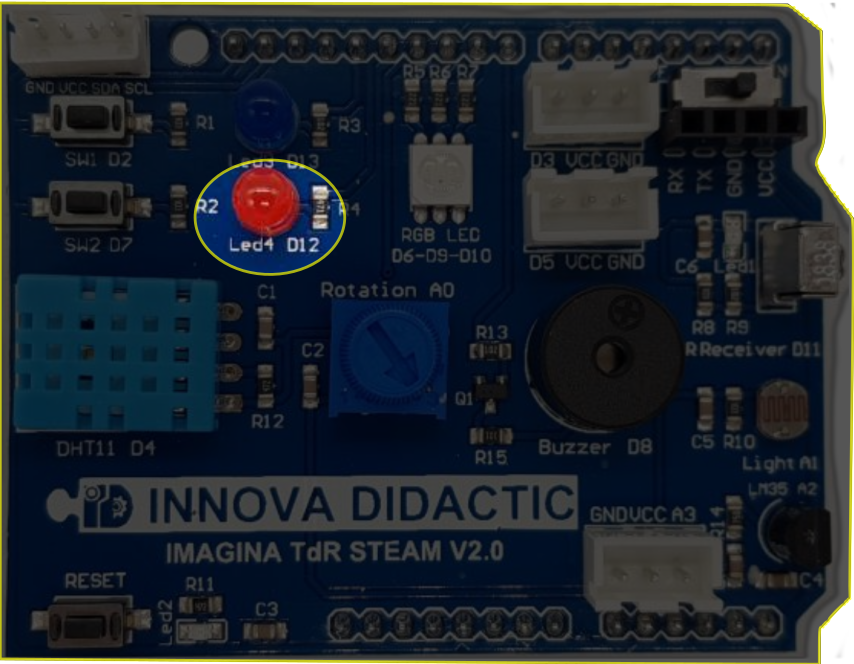
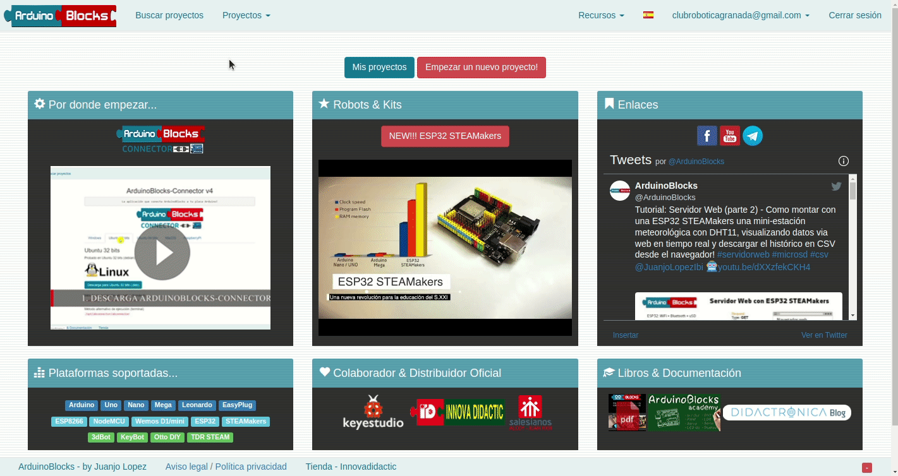
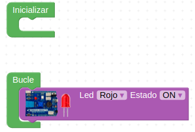
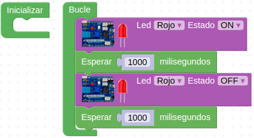
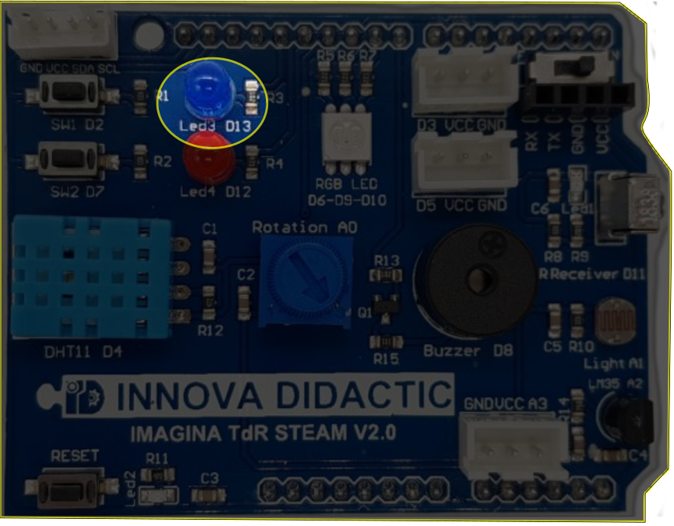
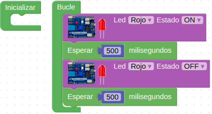
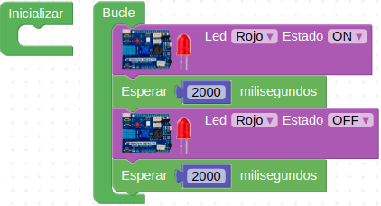
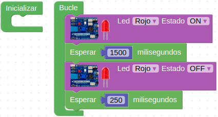
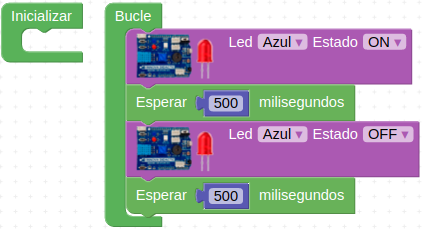
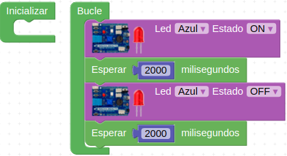

# Reto-01. LED

## Enunciado
Realizar un programa que encienda y apague el LED rojo conectado al pin D12.

## Teoría
El diodo LED (Light Emitting Diode) es un diodo semiconductor capaz de emitir luz, lo mas usuales dentro del espectro visible aunque también pueden ser de infrarrojos, laser, etc. Su uso mas habitual es como indicador y, últimamente cada vez mas frecuentes en iluminación. Sus principales ventajas frente a luces incandescentes son:

* Menor consumo de energia
* Mayor vida útil
* Menor tamaño
* Gran durabilidad y fiabilidad
* En la imagen siguiente vemos el aspecto físico que tiene y su símbolo electrónico.

| Aspecto y símbolo del LED |
|:|
|  |

El color de la cápsula es simplemente orientativo de la longitud de onda que define realmente el color de la luz emitida. Por ello el LED con la cápsula transparente puede emitir en cualquiera de los colores del espectro visible.

El LED es un dispositivo que tiene polaridad siendo su comportamiento el siguiente: En polarización directa (ánodo a positivo y cátodo a negativo) el LED emite luz y en polarización inversa (ánodo negativo y cátodo positivo) se comporta prácticamente como un interruptor abierto.

Para su correcto funcionamiento el diodo LED se polariza poniéndole en serie una resistencia que limita la corriente que pasa a través del mismo y, por tanto, determina el nivel de brillo de la luz emitida.

Sin entrar en detalles en la tabla siguiente se dan los valores de tensión directa (VF) y corriente directa (IF) para los colores mas habituales de LEDs. A partir de estos valores y el valor de tensión de alimentación de nuestro LED podemos calcular el valor de la resistencia serie sin mas que aplicar la formula indicada.

| Tensión y corriente para distintos colores |
|:|
|  |

## En la TdR STEAM
La placa Imagina TDR STEAM dispone de un LED rojo conectado al pin D12 tal y como se indica en la serigrafia de la propia placa y que podemos ver en la imagen siguiente:

| LED rojo en la TdR STEAM |
|:|
|  |

## Programando el reto
Entramos en ArduinoBlocks y nos identificamos convenientemente. Vamos a crear un nuevo proyecto para la placa TdR STEAM siguiendo el procedimiento que vemos en la siguiente animación:

Escogemos el bloque LED de TDR STEAM y lo colocamos en el bucle, quedando algo similar a la imagen siguiente:

| Bloque LED de TDR STEAM |
|:|
|  |

Podemos comprobar haciendo clic sobre las flechas como podemos cambiar de LED y también como podemos cambiar de estado al LED. Si solamente dejamos este bloque el LED permanecerá encendido de forma permanente y para que se acabe debemos ponerlo en estado OFF. En la imagen siguiente vemos el programa como quedaría.

| LED D12 a ON y OFF |
|:|
|  |

Pero este programa no nos permite ver el efecto de encendido y apagado del LED debido a la velocidad de procesamiento que tiene la placa UNO que tipicamente trabaja a 16 MHz. Esto supone que el micro tarda en ejecutar una instrucción algo mas de 0,06 microsegundos que es mucho menor que la persistencia visual humana de 0,1 segundo aproximadamente. Es decir, en realidad el LED se enciende y se apaga, pero nuestro ojo no puede apreciarlo y lo verá siempre encendido debido a la persistencia visual.

Tenemos por tanto que dejar el diodo un tiempo encendido y otro apagado (pueden ser el mismo tiempo) y para ello vamos a colocar un bloque Esperar desde el bloque de Tiempo. Si dejamos el tiempo por defecto en 100 milisegundos el diodo se encenderá y apagará cada segundo (1000 ms = 1s).

El programa final queda como vemos en la imagen siguiente y lo tenemos disponible en el enlace [Reto-01-LED](http://www.arduinoblocks.com/web/project/631282).

| Programa final para el LED rojo |
|:|
|  |

Conectamos nuestra placa a un puerto USB del ordenador, ponemos en marcha el programa Connector y cargamos el programa en la placa UNO. Podemos observar como el diodo LED rojo parpadea con un intervalo de un segundo.

De esta forma el programa queda grabado en la memoria de programa del microcontrolador y el ciclo se repetirá por tiempo indefinido o hasta que quitemos la alimentación a la placa. Si alimentamos la placa externamente con una fuente de alimentación se ejecutará el programa en memoria.

## Actividades de ampliación
**R1.A1**. Cambiar los tiempos para que el parpadeo sea más rápido, mas lento y que los tiempos de encendido y apagado no coincidan.

**R1.A2**. Repetir el ejercicio A1 utilizando el LED azul conectado al pin D13.

| Diodo LED azul conectado a D13 |
|:|
|  |

### Solución R1.A1
* Más rápido: Programa para parpadeo más rápido. Establecemos el tiempo en 500 ms. Programa disponible en el enlace [Reto-01-A1:mas-rapido](http://www.arduinoblocks.com/web/project/631285).

| Parpadeo a 500 ms |
|:|
|  |

* Más lento: Programa para parpadeo más lento. Establecemos el tiempo en 2 segundos. Programa disponible en el enlace [Reto-01-A1:mas-lento](http://www.arduinoblocks.com/web/project/631295)

| Parpadeo cada 2 segundos |
|:|
|  |

* Diferentes tiempos: Tiempos de encendido y apagado diferentes. Establecemos ON = 1500 ms y OFF = 250 ms. Programa disponible en el enlace [Reto-01-A1:diferentes](http://www.arduinoblocks.com/web/project/631297)

| Estados ON y OFF con tiempos diferentes |
|:|
|  |

### Solución R1.A2
Cambiando el diodo LED de los ejercicios de la actividad A1 ya tenemos la solución para esta actividad A2. Es un buen ejercicio jugar con los tiempos para ver el efecto real que estos tienen. En las imágenes siguientes tenemos las soluciones y los enlaces a los programas.

* Más rápido

| Parpadeo azul a 500 ms |
|:|
|  |

* Más lento

| Parpadeo azul a 2s |
|:|
|  |

* Diferentes tiempos

| Parpadeo azul tiempos diferentes |
|:|
|  |

