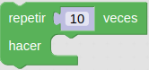
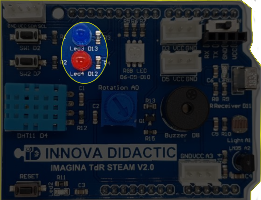
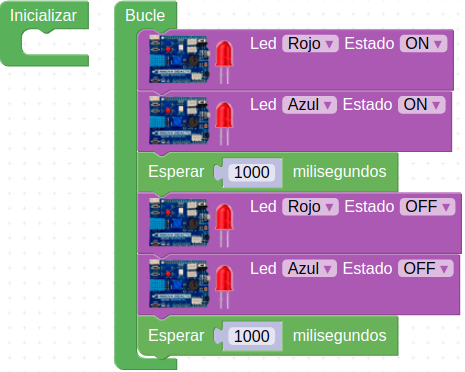
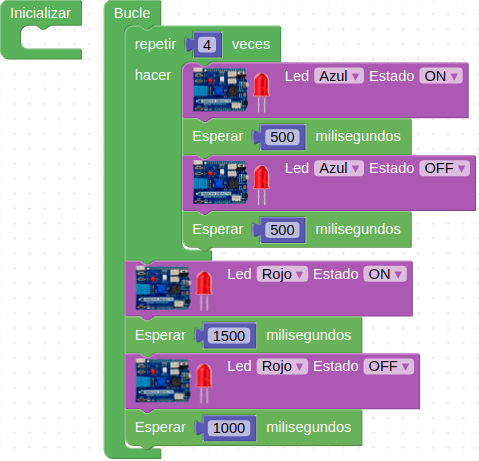
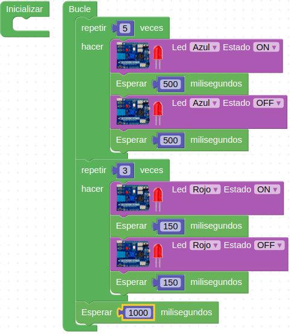

# Reto-02. LEDs rojo y azul

## Enunciado
Como ya hemos visto anteriormente la placa dispone de dos LED (uno rojo y otro azul). Vamos a realizar un programa para que se vayan alternando en su encendido y apagado.

## Teoría
Vamos a ver como se hacen los ciclos de repetición o bucles en ArduinoBlocks. En el menú de Control existe el bloque Repetir (valor) veces hacer… como el de la imagen siguiente:

| Bucle |
|:|
|  |

Lo que pongamos en hacer se va a repetir tantas veces como indiquemos en el número de veces, que por defecto estará a 10.

En realidad lo que estamos haciendo es lo que en programación se conoce como bucle for.

## En la TdR STEAM

| Los dos LEDs de la TdR-STEAM |
|:|
|  |

## Programando el reto
Vamos a hacer que ambos diodos se enciendan y apaguen de forma simultanea con un programa como el siguiente, que lo tenemos disponible en [Reto-02. LED-rojo-azul](http://www.arduinoblocks.com/web/project/632234)

| Intermitencia LEDs rojo y azul |
|:|
|  |

## Actividades de ampliación

**R2.A1**. (No resuelta) Hacer que los LEDs rojo y azul se enciendan simultaneamente con tiempos de espera de 300ms y 150ms respectivamente.

**R2.A2**. Realizar 4 intermitencias de 500ms con el LED azul y cuando estas acaben dejar el LED rojo encendido durante 1.5 segundos. Esperar un segundo para iniciar de nuevo el proceso.

**R3.A3**. Realiza 5 intermitencias de 500ms con el LED azul cada vez que el LED rojo lo hace 3 veces a intervalos de 150ms. Esperar un segundo para iniciar de nuevo el proceso.

### Solución R2.A2
El Programa de la imagen siguiente está disponible en el enlace [Reto-02-A2](http://www.arduinoblocks.com/web/project/631808)

| Solución a la Actividad 2 del Reto 2 |
|:|
|  |

### Solución R2.A3
El Programa de la imagen siguiente está disponible en el enlace [Reto-02-A3](http://www.arduinoblocks.com/web/project/631822)

| Solución a la Actividad 3 del Reto 2 |
|:|
|  |

