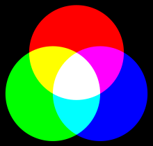
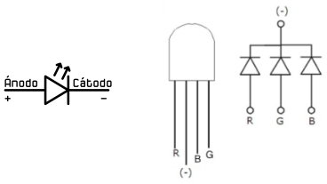
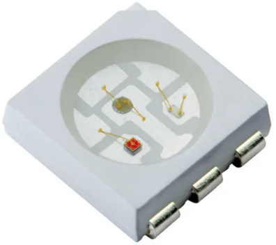
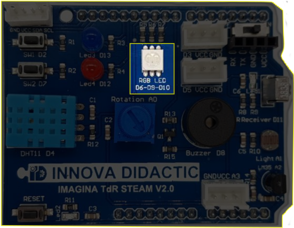
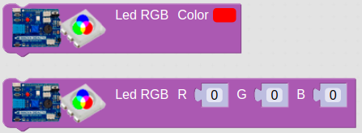
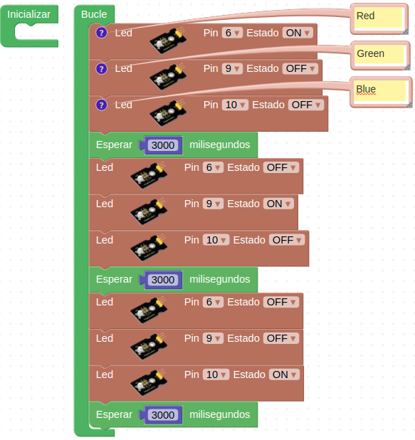
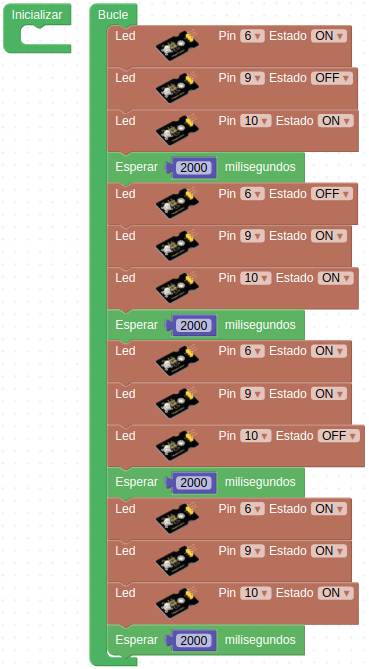
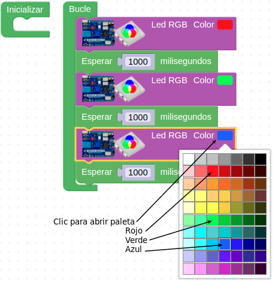
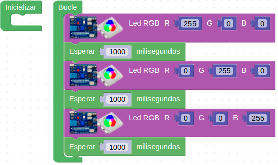
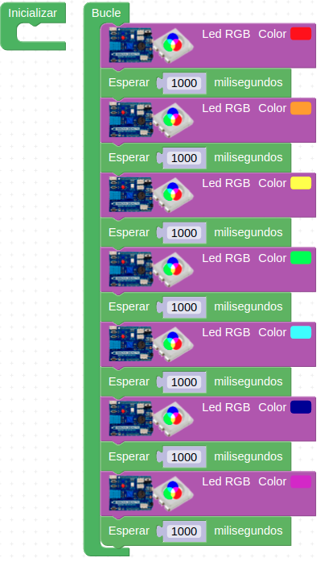

# Reto-03. LED RGB

## Enunciado
El reto básico consistirá en ver los colores primarios y su mezcla mediante el uso del LED RGB y también habrá un reto secundario sobre el control de intensidad mediante PWM.

## Teoría

### LED RGB
Un LED RGB es en realidad un encapsulado que incorpora tres diodos LED, uno por cada color fundamental. Los colores primarios en óptica son el rojo, el verde y el azul y la correcta combinación, en términos de intensidad, de ellos originará cualquiera de los colores secundarios. Las siglas RGB son el acrónimo de Red, Green y Blue. En el caso de la TDR-STEAM se utiliza un LED RGB con los tres LEDs unidos por su cátodo o terminal negativo, es decir es un LED RGB de cátodo común. En la imagen siguiente vemos el modelo aditivo de los colores rojo, verde y azul.

| RGB |
|:|
|  |

El símbolo y la representación mas comunes de este componente lo vemos en la imagen siguiente:

| Símbolo y representación |
|:|
|  |

Teóricamente en Arduino, cada uno de esos LEDs podría adoptar 256 (valores entre 0 y 255) colores diferentes, es decir, un total de 16.777.216 posibles colores diferentes con un LED RGB.

### PWM
PWM son siglas en inglés que significan Pulse Width Modulation y que lo podemos traducir a español como Modulación de ancho de pulso. Los pines PWM permiten generar una señal analógica mediante una salida digital mapeada con 8 bits, o lo que es lo mismo, valores del 0 al 255, es decir mediante una salida PWM podemos emular una señal analógica.

En realidad una placa tipo UNO no es capaz de generar una salida analógica y lo que se hace es emplear un truco que consiste en activar una salida digital durante un tiempo y el resto del tiempo del ciclo mantenerla desactivada. El valor promedio de la salida es el valor analógico. En el tipo de modulación PWM mantendremos constante la frecuencia, o lo que es lo mismo, el tiempo entre pulsos y lo que se hace es variar la anchura del pulso.

La proporción de tiempo que está encendida la señal, respecto al total del ciclo, se denomina ciclo de trabajo o Duty cycle, y generalmente se expresa en tanto por ciento. En la imagen siguiente vemos señales con distintos ciclos de trabajo.

| Distintos Duty cicle |
|:|
|  |

Es importante recordar que en una salida PWM el valor de la tensión es 5V por lo que si alimentamos un dispositivo de 3V a partir de una salida de 5V lo dañaremos de forma irreversible.

Las señales PWM emula una señal analógica para aplicaciones como variar la luminosidad de un LED y variar la velocidad de motores de corriente continua.

Aunque las placas tipo UNO disponen de seis salidas PWM (D3, D5, D6, D9, D10 y D11) en la placa TdR STEAM solamente se controlan por PWM los pines D6, D9 y D10 que es donde va conectado el LED RGB.

## En la TdR STEAM
En la placa existe un LED RGB 5050 de 6 pines como el de la imagen siguiente conectado a los pines D6 (Red), D9 (Green) y D10(Blue). Estos tres pines son PWM y nos van a permitir regular su intensidad.

| RGB 5050 |
|:|
|  |

 En la placa TdR STEAM se localiza donde vemos en la imagen siguiente:

| LED RGB |
|:|
|  |

## Programando el reto
En ArduinoBlocks disponemos de los dos bloques que vemos en la imagen siguiente para el control PWM del LED RGB.

| Bloques ArduinoBlocks para control PWM del LED RGB |
|:|
|  |

El bloque superior permite asignar el color a partir de la paleta que se despliega al hacer clic sobre el cuadrado de color y en el inferior debemos introducir el valor numérico (entre 0 y 255) correspondiente a cada color primario en cada uno de los tres colores RGB. Con estos bloques no tenemos que preocuparnos por saber las conexiones de cada diodo ya que están asignadas internamente en el bloque.

También hemos visto que el LED RGB tiene asociados tres pines y por tanto podemos tratar a cada LED de forma individual. Pero para poder hacerlo debemos crear un tipo de proyecto "Arduino UNO" y no como hasta ahora "Arduino UNO + Imagina TdR STEAM". Esto nos va a permitir disponer del bloque LED que está dentro de "Actuadores" con todos los pines digitales configurables. De esta forma un programa como el de la imagen siguiente nos va a permitir activar de forma individual cada diodo LED. La solución al reto la tenemos disponible en [Reto-03](http://www.arduinoblocks.com/web/project/632244).

| Reto 03 |
|:|
|  |

## Actividades de ampliación

**R3.A1**. A partir de la idea del reto realizar un programa que muestre sucesivamente los siguientes colores: magenta o violeta, cian o azul claro, amarillo y blanco. Ayúdate del gráfico que muestra el modelo aditivo de colores que hemos puesto al principio de la teoría.

**R3.A2**. Realizar un programa que nos muestre los tres colores primarios a partir de un proyecto tipo "Arduino UNO + Imagina TdR STEAM" y el bloque con la paleta de colores.

**R3.A3**. Realizar un programa que nos muestre los tres colores primarios a partir de un proyecto tipo "Arduino UNO + Imagina TdR STEAM" y el bloque con el valor numérico de cada color.

**R3.A4**. Realizar un programa que muestre de manera secuencial los colores del arcoiris en el orden que vemos en la imagen siguiente.

| Colores del arcoiris |
|:|
|  |

### Solución R3.A1
El Programa de la imagen siguiente está disponible en el enlace [Reto-03-A1](http://www.arduinoblocks.com/web/project/632295).

| Modelo aditivo de colores primarios |
|:|
|  |

### Solución R3.A2
El Programa de la imagen siguiente está disponible en el enlace [Reto-03-A2](http://www.arduinoblocks.com/web/project/632345).

| Actividad 2 del reto 3 |
|:|
|  |

### Solución R3.A3
El Programa de la imagen siguiente está disponible en el enlace [Reto-03-A3](http://www.arduinoblocks.com/web/project/632361).

| Actividad 3 del reto 3 |
|:|
|  |

### Solución R3.A4
El Programa de la imagen siguiente está disponible en el enlace [Reto-03-A4](http://www.arduinoblocks.com/web/project/632372).

| Actividad 4 del reto 3 |
|:|
|  |

