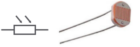
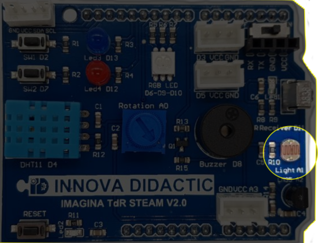
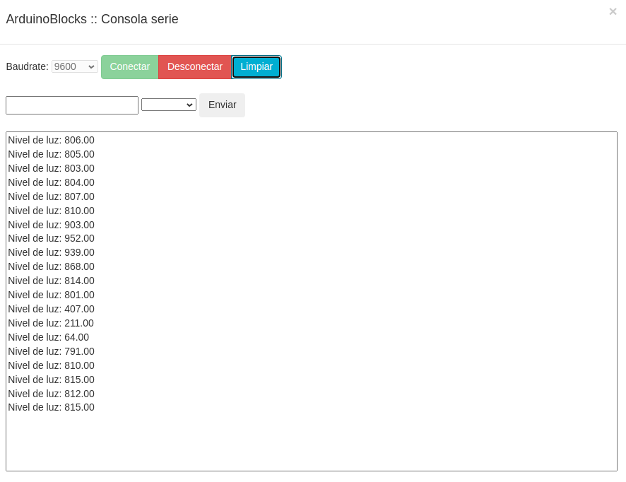
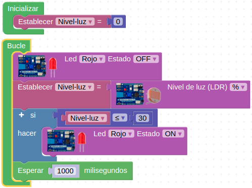

# Reto-07. Fotorresistencia LDR

## Enunciado
Utilizaremos la consola serie para mostrar los valores de luz detectados por la resistencia LDR o fotocélula.

## Teoría
Una fotorresistencia o fotorresistor es un componente electrónico cuya resistencia disminuye de forma exponencial con el aumento de la intensidad de luz incidente. Las siglas LDR vienen de su nombre en inglés, que es Light Dependent Resistor. En la imagen siguiente tenemos el símbolo, el aspecto real de una LDR y su curva característica de vriación de resistencia con la iluminación.

| Simbolo y aspecto de la LDR | Curva característica |
|:|:|
|  | |

## En la TdR STEAM

| La LDR en la TdR STEAM |
|:|
|  |

## Programando el reto
Dado que en el menú TDR STEAM de ArduinoBlocks tenemos disponible un bloque que nos devuelve el nivel de luz en porcentaje o de forma numérica. La solución al reto la tenemos disponible en [Reto-07](http://www.arduinoblocks.com/web/project/635300) que es el programa que vemos en la imagen siguiente:

| Reto 7 |
|:|
|  |

Esto nos generará algo como lo de la imagen siguiente en la consola:

| Consola que produce el Reto 7 |
|:|
|  |

## Actividades de ampliación

**R7.A1**. Programar un interruptor crepuscular utilizando la LDR y uno de los LEDs para simular el farol. El nivel de luz mínimo permitido antes de encender el farol es del 30%, de forma que con un valor menor o igual al 30% se enciena el LED y con un valor mayor permanezca apagado.

### Solución R7.A1
El Programa de la imagen siguiente está disponible en el enlace [Reto-07-A1](http://www.arduinoblocks.com/web/project/635382).

| Actividad 1 del reto 7 |
|:|
|  |

