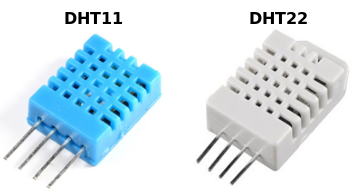
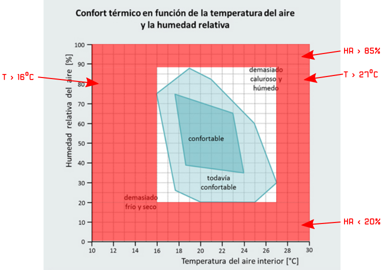
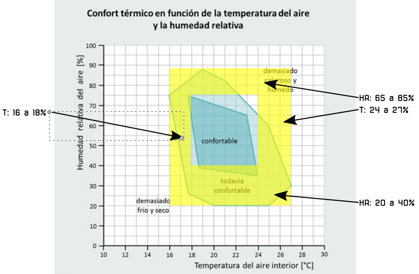

# Reto-09. Sensor de temperatura/humedad DHT-11

## Enunciado
Realizar un programa básico de medida de temperatura y humedad relativa de la habitación en la que estamos trabajando con nuestra TdR STEAM.

## Teoría
El DHT11 es un modelo de sensor que permiten realizar la medición simultánea de temperatura y humedad. Dispone de un procesador interno que es el encargado de realizar la medición entregando la información mediante una señal digital.

Se presenta en un encapsulado plástico característico de color azul. Sus principales características son:

* Rango de temperatura: 0 a 50ºC
* Precisión de la medida de temperatura: +/-2ºC
* Rango de humedad: 20 a 80%
* Precisión en la medida de humedad: +/-5%. 
* Frecuencia de muestreo: 1 muestra por segundo (1 Hz)

El DHT11 es un sensor bastante limitado que podemos usar con fines de formación, pruebas, o en proyectos que realmente no requieran una medición precisa.

Si necesitamos mayor precisión y rango podemos recurrir al DHT22 que es de la misma familia y lo único que cambia es sus características y el precio. Sus características son:

* Rango de temperatura: -40 a 125ºC
* Precisión de la medida de temperatura: +/-0.5ºC
* Rango de humedad: 0 a 100%
* Precisión en la medida de humedad: +/-2 a 5%
* Frecuencia de muestreo: 2 muestras por segundo (2 Hz)

En la imagen siguiente vemos el aspecto de ambos sensores:

| Aspecto DHT11 y DHT22 |
|:|
|  |

## En la TdR STEAM

| El DHT11 en la TdR STEAM |
|:|
|  |

## Programando el reto
De nuevo realizaremos la programación del reto como en los retos anteriores y el programa [Reto-09](http://www.arduinoblocks.com/web/project/635764) lo vemos en la imagen siguiente:

| Programa del Reto 9 |
|:|
|  |

## Actividades de ampliación

**R9.A1**. Realizar un programa que nos muestre el estado de confort según las explicaciones que se dan a continuación y la idea del semáforo vista en la actividad 2 del Reto 8.

En la web ARQUITECTURA & ENERGÍA podemos encontrar un artículo donde se nos explica con bastante profundad el tema del [corfort térmico](http://www.arquitecturayenergia.cl/home/el-confort-termico/).

Puede definirse confort térmico, o más propiamente comodidad higrotérmica, como la ausencia de malestar térmico. En fisiología, se dice que hay confort higrotérmico cuando no tienen que intervenir los mecanismos termorreguladores del cuerpo para una actividad sedentaria y con una indumentaria ligera. Esta situación puede registrarse mediante índices que no deben ser sobrepasados para que no se pongan en funcionamiento los sistemas termorreguladores (metabolismo, sudoración y otros).

En la imagen siguiente vemos los valores de temperatura y humedad que delimitan las zonas de confortabilidad.

| Confort térmico en función de temperatura y humedad |
|:|
|  |

Sobre el gráfico vamos a delimitar zonas de temperatura y humedad para establecer su color. Por motivos de simplicidad lo vamos a hacer delimitando zonas rectangulares, pero comprobamos que no cometemos grandes errores y para nuestro propósito nos sirve.

**1.- Zona Roja**: en la imagen siguiente tenemos delimitadas las zonas:

- Humedad Relativa: superior al 85% e inferior al 20%
- Temperatura: superior a 27 e inferior a 16ºC

| Delimitación color rojo zona de confort  |
|:|
|  |

**2.- Zona Amarilla**: en la imagen siguiente tenemos delimitadas las zonas:

- Humedad Relativa: entre el 20% y el 40% y entre el 65% y el 85%
- Temperatura: entre 16ºC y 18ºC y entre 24ºC y 27ºC

| Delimitación color amarillo zona de confort  |
|:|
|  |

**3.- Zona Verde, rojo y amarillo**: en la imagen siguiente tenemos delimitadas todas las zonas, correspondiendo a la verde los siguientes datos:

- Humedad Relativa: entre el 40% y el 65%
- Temperatura: entre 18ºC y 24ºC

| Delimitación colores zona de confort  |
|:|
|  |

En este enlace al archivo [colores-R9.A1.svg](../img/img/Reto-09/colores-R9.A1.svg) puedes ver como se han realizado estos gráficos.

## Actividades de ampliación

**R9.Actividad-propuesta**. Idear método para probar de forma completa la funcionalidad del programa anterior. Si es necesario se modifica el programa. También se pide explicar la misión de la función "limite-confort".

## Solución R9.A1
Para resolver la actividad vamos a necesitar varios bloques del menú "Lógica" y especialmente combinando funciones AND y OR multiples. Si necesitamos, por ejemplo, aumentar el número de operadores AND dentro de un bloque simplemente tenemos que combinarlo como vemos en la imagen siguiente, donde se han combinado cuatro bloques AND.

| Combinacion de 4 bloques AND  |
|:|
|  |

El Programa de la imagen siguiente está disponible en el enlace [Reto-09-A1](http://www.arduinoblocks.com/web/project/635916).

| Actividad 1 del reto 9  |
|:|
|  |

