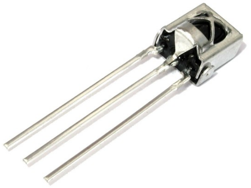

# Reto-10. Emisor y receptor de infrarrojos

## Enunciado
Enviaremos códigos desde el control remoto por infrarrojos que serán recibidos por el LED de infrarrojos para actuar según el código recibido.

## Teoría

### ¿que son los infrarrojos?
Son una clase de radiación electromagnética con una longitud de onda que resulta superior a la longitud de onda de la luz visible, siendo su frecuencia superior a las microondas. Dentro del espectro electromagnético, la radiación infrarroja se encuentra comprendida entre el espectro de luz visible y las microondas. Tiene longitudes de onda mayores o más largas que el rojo. En la imagen siguiente, obtenida del blog de Mercedes González Mas vemos caracterizados los infrarrojos dentro del espectro.

| Espectro electromagnetico |
|:|
|  |

Como podemos observar en la imagen, los rayos infrarrojos son clasificados, de acuerdo a su longitud de onda, del siguiente modo:

* infrarrojo cercano, con longitud de onda entre 0.7 µm y 1.1 µm, es la parte del espectro infrarrojo que ese encuentra más próximo a la luz visible. 
* infrarrojo medio, con longitud de onda entre 1,1 µm y 15 µm.
* infrarrojo lejano o región más cercana a las microondas, con longitud de onda entre 15 µm y 100 µm

En la imagen siguiente, obtenida de [wikipedia](https://es.wikipedia.org/wiki/Espectro_electromagn%C3%A9tico), sobre espectro electromagnético podemos ver más información del tema.

| Espectro electromagnetico |
|:|
|  |

Todos los cuerpos emiten una cierta cantidad de radiación, y aunque esta resulta invisible para el ojo humano, existen dispositivos electrónicos capaces de "verla" por estar diseñados para ello.

### Receptor de infrarrojos
Uno de los receptores más universal utilizado en placas tipo Arduino es el receptor de infrarrojos universal TL1838, VS1838B o simplemente 1835 de 38KHz, cuyo aspecto podemos ver en la imagen siguiente:

| Diodo IR 1838 |
|:|
|  |

En el [datasheet TL1838](Datasheet/Tl1838.pdf) del dispositivo tenemos toda la información sobre el mismo destacando las siguientes características:

* Voltaje de funcionamiento: 2.7V a 5.5V
* Frecuencia: 37.9KHz
* Ángulo de recepción: 90°
* Rango de recepción: 18m

El dispositivo genera una señal de salida que sirve para controles remotos universales y utiliza la codificación NEC. El receptor de infrarrojos permite codificar los protocolos de señales de pulsos infrarrojos utilizados por los mandos a distancia. Los protocolos detectados son los siguientes: RC5, RC6, NEC, SONY, PANASONIC, JVC, SAMSUNG, WHYNTER, AIWA, LG, SANYO, MITSUBISHI y DENON. Es decir, detectaría cualquier señal emitida por cualquiera de esos mandos.

### Emisor de infrarrojos
En nuestro caso como emisor de infrarrojos vamos a utilizar el control remoto de Keyestudio que vemos en la imagen siguiente:

| Control remoto |
|:|
|  |

El mini control remoto tiene 17 teclas de función y tiene las siguientes especificaciones:

* Batería: pilas de botón CR2025
* Distancia de transmisión: hasta 8 m
* Ángulo efectivo: 60°

El control remoto, o mando a distancia, por IR funciona emitiendo trenes de pulsos de luz infrarroja. Diferentes señales corresponden a botones diferentes La señal infrarroja transmite el código correspondiente al botón del mando a distancia pulsado al dispositivo en forma de una serie de impulsos de luz infrarroja. El receptor recibe la serie de impulsos de infrarrojos y los pasa a un procesador que decodifica y activarán una determinada función del dispositivo. En el reto y las actividades del mismo obtendremos estos códigos. En arduinoBlocks se han asignado los siguientes nombres a las teclas:

| Nombre teclas control remoto en ArduinoBlocks |
|:|
|  |

### Bloques en ArduinoBlocks
El sensor receptor de infrarrojos permite obtener la cadena de texto con el código en formato hexadecimal correspondiente al tren de pulsos de IR generado al pulsar una determinada tecla. El bloque es el que vemos en la imagen siguiente:

| En proyectos que no usen la TdR STEAM | En proyectos con TdR STEAM |
|:|:|
|  |  |

El valor devuelto por el bloque de recepción será una cadena de texto con valor vacío en caso de no detectar ningún código. Al devolver el bloque una cadena de texto debemos recordar que lo tenemos que almacenar en una variable de tipo texto.

Si utilizamos mandos genéricos RC5 como el modelo de Keyestudio, podemos usar el bloque de la imagen siguiente para comparar los códigos recibidos y así identificar fácilmente cada tecla.

| En proyectos que no usen la TdR STEAM | En proyectos con TdR STEAM |
|:|:|
|  |  |

## En la TdR STEAM

| El sensor receptor de IR en la TdR STEAM |
|:|
|  |

## Programando el reto
Vamos a realizar un programa en el que si pulsamos la tecla Ok del control remoto se nos encienda el diodo LED rojo.La solución al reto la tenemos disponible en [Reto-10](http://www.arduinoblocks.com/web/project/636101) que es el programa que vemos en la imagen siguiente:

| Reto 10 |
|:|
|  |

## Actividades de ampliación

**R10.A1**. Realizar un programa que encienda el LED RGB en los colores establecidos a continuación y según la tecla flecha pulsada.

* Flecha arriba = Rojo
* Flecha izquierda = Verde
* Flecha derecha = Amarillo
* Flecha abajo = azul

**R10.A2**. Realizar un programa que nos muestre por consola el código hexadecimal correspondiente a cada una de las teclas pulsadas junto a un texto descriptivo indicar de la tecla pulsada en cada caso, es decir, que mantenga una estructura del tipo: El *CODIGO* se corresponde con la tecla *TECLA* pulsada.

### Solución R10.A1
El Programa de la imagen siguiente está disponible en el enlace [Reto-10-A1](http://www.arduinoblocks.com/web/project/636281).

| Actividad 1 del reto 10 |
|:|
|  |

### Solución R10.A2
El Programa de la imagen siguiente está disponible en el enlace [Reto-10-A2](http://www.arduinoblocks.com/web/project/636343). Se han contraido todos los bloques para que todo el programa entre en una sola pantalla, siendo en cada caso similares a los dos expandidos, el del condicional y el de la función.

| Actividad 2 del reto 10 |
|:|
|  |

El resultado en la consola de pulsar sucesivamente todas las teclas lo vemos en la imagen siguiente:

| Consola de la actividad 2 del reto 10 |
|:|
|  |

