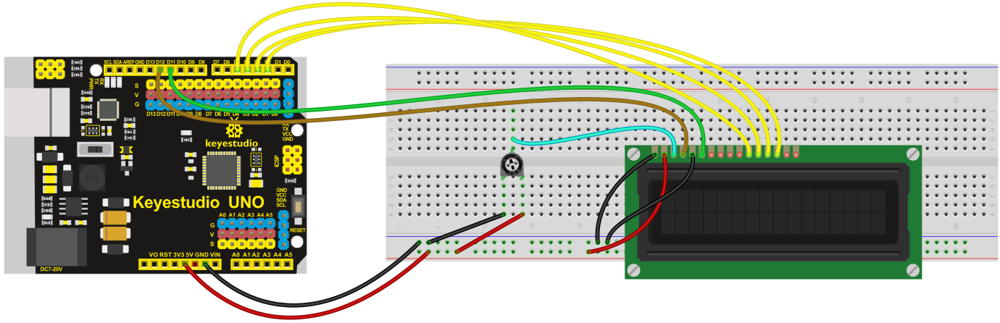
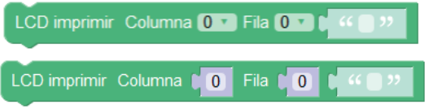
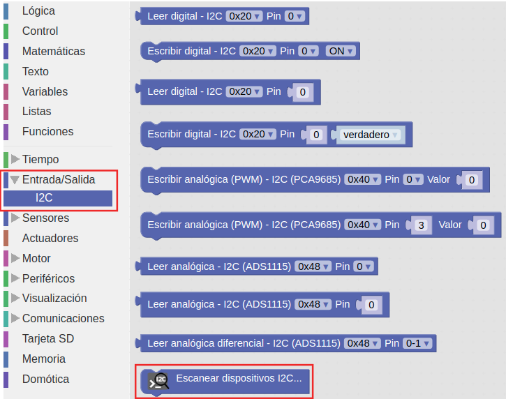
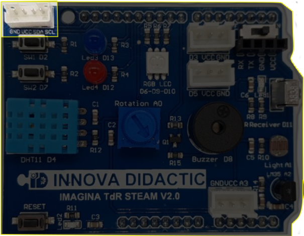

# Reto-11. Puerto de expansión I2C. La LCD de 2x16

## Enunciado
Utilizaremos las comunicaciones I2C para mostrar textos en la pantalla LCD I2C incluida en el kit.

## Teoría

### Las comunicaciones I2C
Dado que la placa TdR STEAM dispone de un puerto de expansión I2C (del inglés Inter-Integrated Circuit = Circuito inter-integrado) vamos a explicar un poco en que consiste este sistema de conexionado.

Bus conocido por las siglas I2C, IIC o I²C, es un bus serie de datos desarrollado en 1982 por Philips Semiconductors (hoy NXP Semiconductors, parte de Qualcomm). Se utiliza principalmente internamente para la comunicación entre diferentes partes de un circuito, por ejemplo, entre un controlador y circuitos periféricos integrados. Posteriormente fue adoptado progresivamente por otros fabricantes hasta convertirse en un estándar del mercado con miles de circuitos integrados de diferentes fabricantes.

I2C también se denomina TWI (Two Wired Interface) únicamente por motivos de licencia, denominación introducida por Atmel. No obstante, la patente caducó en 2006, por lo que actualmente no hay restricción sobre el uso del término I2C.

El bus I2C requiere únicamente dos cables o lineas de señal para su funcionamiento, uno para la señal de reloj (SCL, Serial Clock) y otro para el envío de datos (SDA, Serial Data). Ambas líneas precisan resistencias de pull-up hacia Vcc. Cualquier dispositivo conectado a estas líneas es de drenador o colector abierto (Open Collector), lo cual en combinación con las resistencias pull-up, crea un circuito Wired-AND. En la imagen siguiente vemos el diagrama básico de conexionado del bus con algunos ejemplos de dispositivos. La señal de reloj siempre es generada por el circuito que actúa como Master.

| Diagrama de conexión del bus I2C |
|:|
|  |

Para ser reconocido en el bus, cada dispositivo dispone de una dirección, que se emplea para acceder a cada uno de ellos de forma individual. Esta dirección puede ser fijada por hardware, en cuyo caso se pueden modificar los últimos 3 bits mediante “jumpers” o microinterruptores (ejemplo de la matriz de 8x8), o por software.

En general, cada dispositivo conectado al bus debe tener una dirección única. Si tenemos varios dispositivos similares tendremos que cambiar la dirección o, en caso de no ser posible, implementar un bus secundario.

El bus I2C tiene una arquitectura de tipo master-slave, lo que indica que el master es el encargado de controlar al resto de dispositivos tipo slave con los que se comunica y que se comunican con el, teniendo siempre el marte prioridad absoluta. El dispositivo master es el que inicia la comunicación con los slaves. Los slaves no pueden iniciar la comunicación (el master tiene que preguntarles), ni hablar entre si directamente.

El bus I2C debe ser por lo tanto síncrono, es decir debe existir una señal de reloj que controle las comunicaciones. Es el master el que proporciona la señal de reloj, que mantiene sincronizados a todos los dispositivos del bus. De esta forma, se elimina la necesidad de que cada dispositivo tenga su propio reloj, de tener que acordar una velocidad de transmisión y mecanismos para mantener la transmisión sincronizada como en UART o SPI. En la imagen vemos un cronograma ejemplo del funcionamiento del sistema.

| Cronograma trabajo bus I2C |
|:|
|  |

El protocolo de comunicación I2C sigue la siguiente secuencia:

* Primero, el master genera la señal de reloj del bus (SCL).
* Se inicia la comunicación por orden del master al establecer la condición de START, que se produce cuando SDA pasa de uno a cero y se mantiene en cero durante un tiempo.
* El master direcciona a los slaves.
* El master indica si se va a leer o escribir.
* El slave direccionado responde con una señal de conformidad ACK (acknowledge).
* Se transmite los datos byte a byte desde SDA al receptor. Por cada pulso desde SCL se transmite un bit de información.
* El destinatario de la información responde con una señal de conformidad ACK.
* Se acaba la comunicación cuando el master establece la condición de STOP, que se produce cuando SDA, por orden del master pasa de cero a uno y se mantiene en uno durante un tiempo.

Son muchos los dispositivos I2C que se pueden direccionar por este bus I2C, siendo lo más común en los dispositivos para I2C que utilicen direcciones de 7 bits, aunque existen dispositivos de 10 bits, pero es un caso raro. Una dirección de 7 bits implica que se pueden poner hasta 128 (27) dispositivos sobre un bus I2C. Hemos visto que las direcciones son de 8 bits y esto es porque el bit extra de los 7 de la dirección lo emplea el master para informar al slave si va a leer o escribir. Si el bit de lectura/escritura es cero, el dispositivo master está escribiendo en el slave. Si el bit es 1 el master está leyendo desde el slave. La dirección de 7 bit se coloca en los 7 bits más significativos del byte y el bit de lectura/escritura es el bit menos significativo.

### La LCD 1602
Una pantalla LCD (del ingés, Liquid Cristal Display) de 2 líneas de 16 caracteres tiene el aspecto y la distribución de pines que vemos en la imagen siguiente.

| LCD 2x16 |
|:|
|  |

Es evidente que deberíamos utilizar bastantes patillas de nuestra placa UNO para su control. En la imagen siguiente se muestra el conexionado mínimo necesario en una pantalla de este tipo: 4 bits para datos y dos señales de control En (Enable) y Rs (Register select). La conexión RW la ponemos a GND. Además se debe añadir una resistencia ajustable o un potenciómetro para regular el contraste de la pantalla.

| Conexionado mínimo LCD 2x16 |
|:|
|  |

Es preferible utilizar las que tienen el aspecto que vemos en la imagen siguiente:

| LCD 2x16 con módulo I2C |
|:|
|  |

En realidad el conjunto que vemos en la imagen anterior no es mas que una LCD 2x16 a la que se ha incorporado un módulo adaptador de LCD a I2C. Este modulo está especialmente diseñado para poder soldarlo directamente a la LCD y convertirla así en un dispositivo I2C que además ya lleva incorporado el potenciometro de ajuste de contraste.

Esta pantalla requiere cuatro cables para establecer las conexiones, dos cables SDA (datos) y SCL (reloj) para el bus de comunicaciones I2C y los dos cables de alimentación VCC y GND.

La dirección I2C por defecto de este tipo de módulos puede ser 0x3F o en otros casos 0x27, e incluso hay modelos en los que se puede cambiar. Para un correcto control es muy importante identificar correctamente la dirección I2C de nuestro modulo, que en el caso de la que incorpora el kit TdR STEAM es la 0x27, pues de otra forma nuestro programa no funcionará correctamente.

Una LCD 1602 I2C es muy sencilla de controlar a partir de los bloques que nos proporciona ArduinoBlocks. En la imagen siguiente ponemos como ejemplo los bloques para imprimir un texto o variable en un par fila-columna determinado y se muestra el sistema de distribución de filas y columnas.

| Bloques para imprimir en un par fila-columna | Sistema de coordenadas en una LCD 1602 |
|:|:|
|  |  |

### Escanear dispositivos I2C
Si no conocemos la dirección especifica de nuestro módulo podemos utilizar un pequeño programa que llamaremos Escaner-I2C y que se encargará de identificar la dirección I2C y todos los dispositivos I2C conectados a nuestra placa. Debemos crear un proyecto, en esta ocasión, de tipo "Arduino UNO" para tener disponible el menú I2C que nos de acceso al bloque "Escanear dispositivos I2C..." tal y como vemos en la imagen siguiente:

| Menu I2C |
|:|
|  |

Un sencillo programa como el de la imagen siguiente nos permite ver los dispositivos I2C conectados y su dirección física asociada. El programa está disponible como [Escaner-I2C](http://www.arduinoblocks.com/web/project/637339).

| Programa Escaner-I2C |
|:|
|  |

Si conectamos la consola el resultado de tener la placa TdR STEAM es el de la imagen siguiente:

| Consola para el programa Escaner-I2C |
|:|
|  |

### Cambiar la dirección física del dispositivo I2C
Esta tarea nos va a resultar especialmente útil si disponemos de LCDs I2C con una dirección fijada de fábrica y queremos conectar varias de ellas en nuestro proyecto. La parte posterior de la LCD 1602 de Keyestudio tiene el aspecto de la imagen siguiente. Nos fijaremos especialmente en los tres grupos de agujeros enmarcados en rojo. Aunque en este caso no vienen nombrados los vamos a denominar A0, A1 y A2 de izquierda a derecha.

| Pads configuración dirección física en la parte posterior LCD I2C |
|:|
|  |

La dirección por defecto de fábrica en este caso es la 0x27, pero se puede cambiar alterando la situación de conexionado de estos agujeros entre si según la tabla siguiente:

| A2 | A1 | A0 | Dirección |
|:|:|:|:|
| 0 | 0 | 0 | 0x27 |
| 0 | 0 | 1 | 0x26 |
| 0 | 1 | 0 | 0x25 |
| 0 | 1 | 1 | 0x24 |
| 1 | 0 | 0 | 0x23 |
| 1 | 0 | 1 | 0x22 |
| 1 | 1 | 0 | 0x21 |
| 1 | 1 | 1 | 0x20 |

Para establecer los unos de la tabla anterior basta con cortocircuitar los dos pads correspondientes. En la imagen siguiente se ha establecido la dirección física como 0x26.

| Dirección 0x26 |
|:|
|  |

### Definición de símbolos en la LCD
Dentro de los bloques del menú Visualización -> Pantalla LCD está el de "definir símbolo", que permite definir uno de los 8 símbolos personalizables que puede almacenar la pantalla LCD. El símbolo se define por un mapa de bits (unos y ceros indicando cada píxel del símbolo). Los símbolos tienen una resolución de 5x8 píxeles (blanco o negro).

En ArduinoBlocks disponemos de una herramienta que nos ayuda a definir nuestros propios símbolos y podemos acceder a ella desde herramientas o haciendo clic derecho sobre el bloque, desplegándose en cualquier caso un editor muy sencillo de usar y que vemos con un ejemplo en la imagen en la siguiente:

| Ejemplo de simbolo creado con el editor |
|:|
|  |

Para tener el símbolo disponible simplemente copiamos la cadena generada en el lugar correspondiente del bloque.

## En la TdR STEAM
En la placa TdR STEAM tenemos el conector I2C con los mismo pines de conexión que la LCD y debemos respetar el orden de conexionado indicado en la siguiente tabla:

| TdR STEAM | LCD 1602 | Color cable |
|:|:|:|
| GND | GND | Negro |
| Vcc | Vcc | Rojo |
| SDA | SDA | Amarillo |
| SCL | SCL | Blanco |

La ubicación del conector I2C en la TdR STEAM lo vemos en la imagen siguiente:

| Conector I2C en la TdR STEAM |
|:|
|  |

## Programando el reto
Como primer ejemplo de uso vamos a mostrar una información determinada en la pantalla LCD, en concreto vamos a mostrar cuatro textos en ambas filas que se irán alternando cada tres segundos en la pantalla. El programa de la imagen siguiente lo tenemos disponible en [Reto-11](http://www.arduinoblocks.com/web/project/636453).

| Reto 11 |
|:|
|  |

## Actividades de ampliación

**R11.A1**. Corregir el error ortográfico en la palabra "Robotica" del Reto 11. Para ello tenemos que definir nuestro propio símbolo de "ó" (o acentuada).

**R11.A2**. Realizar un control de iluminación del LED RGB mediante PWM y mostrar por pantalla el valor de la iluminación en cada instante. Se realizará el control desde el mínimo de iluminación a máximo y cuando se alcance el máximo bajamos otra vez a mínimo.

### Solución R11.A1
Definimos el símbolo requerido tal y como vemos en la imagen siguiente:

| Símbolo o acentuada |
|:|
|  |

El Programa de la imagen siguiente está disponible en el enlace [Reto-11-A1](http://www.arduinoblocks.com/web/project/637464).

| Actividad 1 del reto 11 |
|:|
|  |

### Solución R11.A2
El Programa de la imagen siguiente está disponible en el enlace [Reto-11-A2](http://www.arduinoblocks.com/web/project/637505). Se ha resuelto con un contador ascendente y otro descendente sobre el LED rojo. Se pueden probar diferentes opciones de LEDs o incluso combinación de ellas. También se anima al lector a comprobar que ocurre si quitamos la opción "Número entero" y ponemos directamente la variable del bucle y buscar la explicación.

| Actividad 2 del reto 11 |
|:|
|  |

