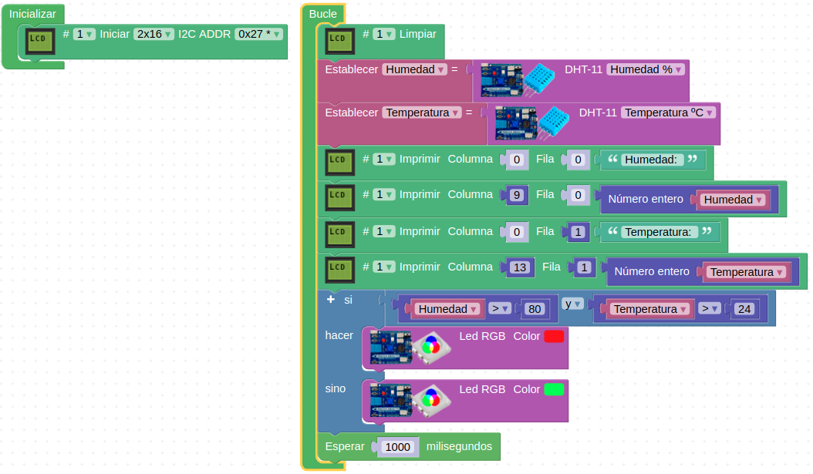
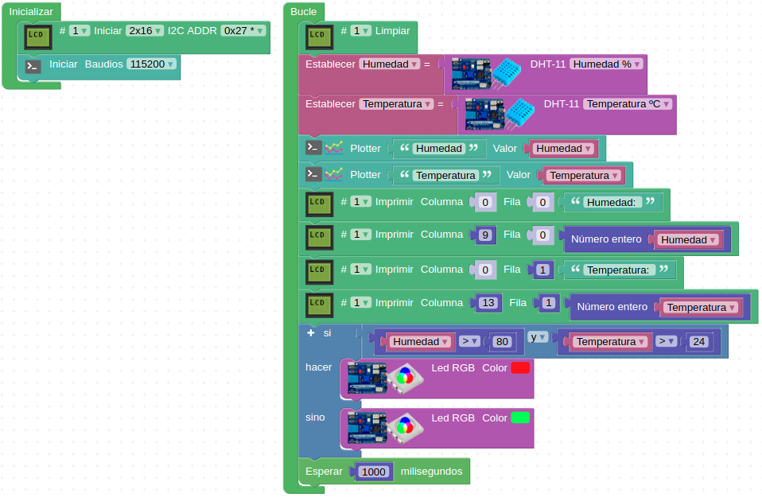
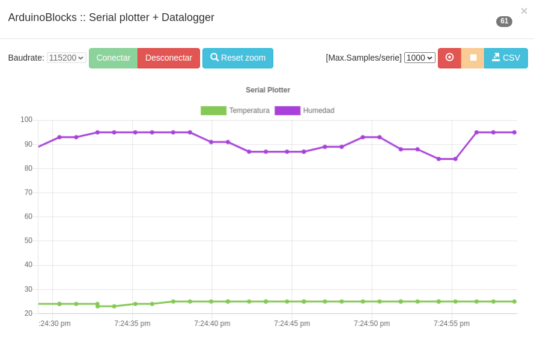
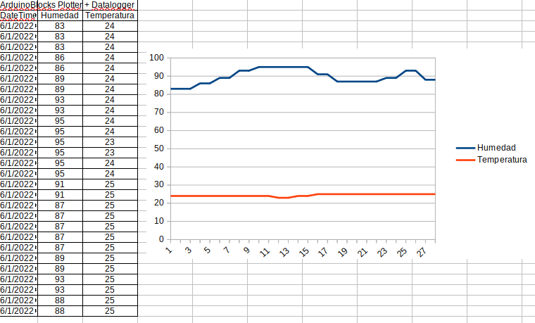

# Reto-13. Termohigrómetro

## Enunciado
Utilizando el sensor de temperatura y humedad DHT11, el LED RGB y la LCD vamos a construir un higrómetro capaz de detectar si la humedad es superior al 80% y la temperatura los 20ºC, en cuyo caso se encenderá en rojo el LED RGB y si es inferior de color verde. Deberá mostrar los datos de temperatura y humedad en la pantalla LCD.

## Programando el reto
El programa de la imagen siguiente resuelve el reto 13 y está disponible en [Reto-13](http://www.arduinoblocks.com/web/project/637561).

| Reto 13 |
|:|
|  |

## Actividad propuesta
**R13.A1**. Mostrar y exportar los datos con el datalogger y analizar la exportación mediante una gráfica realizada en hoja de cálculo a partir de los datos exportados.

### Solución R13.A1
El programa es el mismo que el el del reto 13 añadiendo la inicialización de la conexión serie y enviando los dos datos al Plotter, lo vemos en la imagen siguiente y está disponible en [R13.A1](http://www.arduinoblocks.com/web/project/637567).

| Actividad 1 del reto 13 |
|:|
|  |

En el Serial Plotter veremos algo similar a lo siguiente:

| Captura del Serial Plotter |
|:|
|  |

Una vez cargados los datos de temperatura y humedad en una hoja de cálculo y realizada una gráfica de los mismo tenemos algo similar a lo que vemos en la imagen siguiente:

| Los datos del Higrómetro en una hoja de cálculo |
|:|
|  |

En el archivo [Reto-13.zip](../docs/Programas/Reto-13.zip) están los datos exportados y la hoja de cálculo con el análisis realizado.
