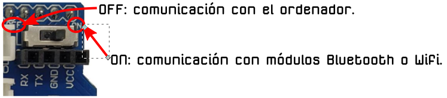
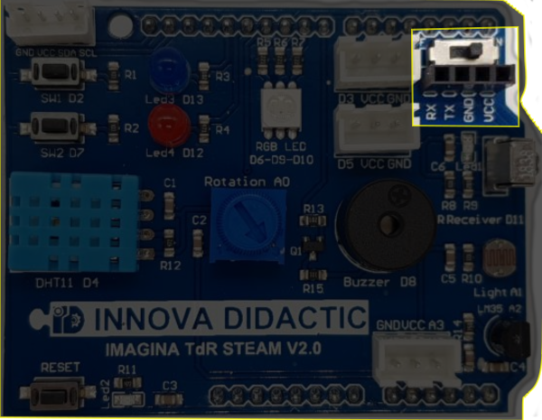
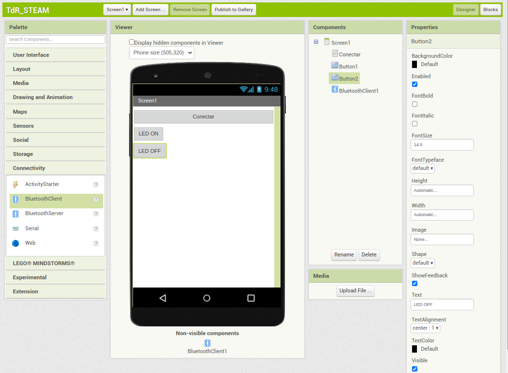
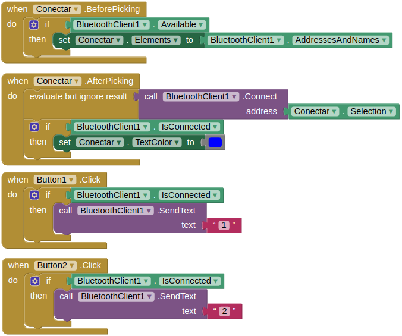
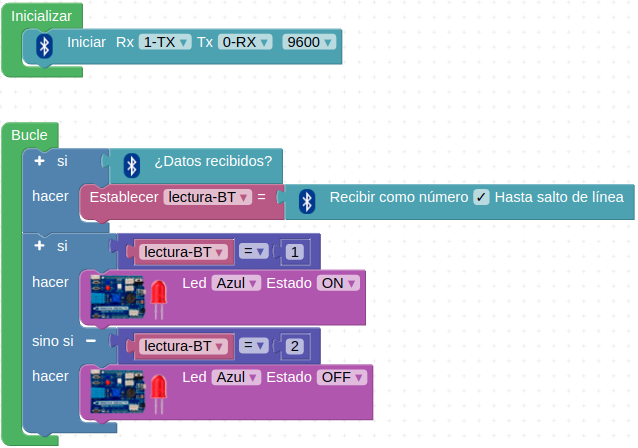
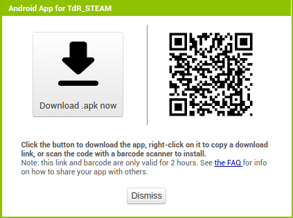

# Reto-14. Bluetooth

## Enunciado
Crear una aplicación para comunicarnos por Bluetooth con la placa TdR STEAM desde nuestro móvil.  

## Teoría
En la placa TDR STEAM tenemos disponible un puerto de comunicaciones serie que nos permite conectar módulos Bluetooth o Wifi. Este puerto va equipado de un interruptor para poder conectarlo o desconectarlo ya que utiliza los mismos pines Rx/Tx que se utilizan para comunicarse con el ordenador. En la imagen siguiente vemos el puerto y el interruptor y la conexión que se realiza según la posición del interruptor.

| Puerto BT y WiFi y posición interruptor |
|:|
|  |

### Módulo Bluetooth
Bluetooth es una especificación industrial para Redes Inalámbricas de Área Personal (WPAN) que posibilita la transmisión de voz y datos entre diferentes dispositivos mediante un enlace por radiofrecuencia en la banda ISM de los 2.4 GHz. Los principales objetivos que se pretenden conseguir con esta norma son:

* Facilitar las comunicaciones entre equipos móviles.
* Eliminar los cables y conectores entre estos.
* Ofrecer la posibilidad de crear pequeñas redes inalámbricas y facilitar la sincronización de datos entre equipos personales.

Se denomina Bluetooth al protocolo de comunicaciones diseñado especialmente para dispositivos de bajo consumo, que requieren corto alcance de emisión y basados en transceptores (dispositivos que cuentan con transmisor y receptor compartiendo parte de la circuitería) de bajo costo.

El hardware que compone el dispositivo Bluetooth está compuesto por dos partes:

* un dispositivo de radio, encargado de modular y transmitir la señal.
* un controlador digital, compuesto por una CPU, un procesador de señales digitales (DSP – Digital Signal Processor) llamado Link Controller (o controlador de Enlace) y de las interfaces con el dispositivo anfitrión.

Existe un procedimiento definido que se llama Pairing (o emparejamiento) que vincula a dos dispositivos Bluetooth. Cuando vinculamos dos dispositivos Bluetooth, se inicia un proceso en el que ellos se identifican por nombre y dirección interna y se solicitan la clave PIN para autorizar la conexión.

Si el emparejamiento se realiza con éxito, ambos nodos suelen guardar la identificación del otro y cuando se encuentran cerca se vuelven a vincular sin necesidad de intervención manual.

Para manejar los módulos Bluetooth se utilizan los comandos Hayes o AT, de los que puedes encontrar información en este [enlace](https://es.wikipedia.org/wiki/Conjunto_de_comandos_Hayes) y a continuación damos algunos básicos:

* AT+VERSION: Versión del Firmware. 
* AT+NAMEXXX: Para establecer el nombre que queremos presentar cuando otro dispositivo nos busque.
* AT+PINXXXX: permite establecer el número de identificación personal, que se requerirá para establecer la vinculación.
* AT+BAUDX: Permite fijar la velocidad de comunicación entre el modulo y la consola según los siguientes pares:

- 1 -> 1200 bps | -5 -> 19200 bps
- 2 -> 2400 bps | -6 -> 38400 bps
- 3 -> 4800 bps | -7 -> 57600 bps
- 4 -> 9600 bps | -8 -> 115200 bps

La velocidad por defecto es la de 9600 bps.

Los módulos mas conocidosson el HC-05 y HC-06 que son Bluetooth V2 y cuyo aspecto podemos ver en la imagen siguiente:

| Módulos HC-05 y HC-06 |
|:|
|  |

Para poder hacer la comunicación por Bluetooth con nuestra placa Imagina TdR STEAM tenemos que conectar un módulo Bluetooth en el conector de comunicaciones serie. En nuestro caso utilizaremos un módulo HC-06.

## En la TdR STEAM

| El puerto de comunicaciones Rx/Tx en la TdR STEAM |
|:|
|  |

Es muy importante poner el interruptor en la posición adecuada según queramos funcionar en modo Bluetooth o programar la placa UNO. Recordemos que:

* Interruptor en posición OFF: para grabar firmware desde ArduinoBlocks.
* Interruptor en posición ON: modo Bluetooth.

## Programando el reto
Vamos a necesitar dos programas para poder trabajar, a saber:

* Un programa que haga funcionar la placa UNO con la shield TdR STEAM que programaremos desde ArduinoBlocks.
* Una aplicación que funcionará en nuestro teléfono móvil que programaremos con AppInventor2.

### Programa en AppInventor2
No vamos a entrar en detalles sobre el tema y simplemente expondremos el proceso que seguimos paso a paso. Lo primero que debemos hacer es crear una cuenta, si no la tenemos ya, y loguearnos en MIT App Inventor. Una vez hecho esto procedemos a crear nuestra aplicación tanto en "Designer" como en "Blocks". Este es el paso a paso seguido:

* **Paso 1**: Configuramos "Designer" para que tenga el aspecto que vemos en la imagen siguiente:

| Designer en AppInventor |
|:|
|  |

Se han colocado un ListPicker, dos botones y un cliente de Bluettoth sobre un nuevo proyecto creado desde la paleta de componentes. El ListPicker se ha renombrado y se ha establecido que su anchura se adapte a su contenedor (Fill parent) y a cada uno de los botones se le ha modificado el texto por defecto para que sea el que se ve en la imagen. El componente BluetoothClient no será visible en la APP.

* **Paso 2**: Nos cambiamos al modo programación haciendo clic sobre el botón Blocks en la esquina superior derecha. Vamos localizando y configurando los distintos bloques que vemos en la imagen siguiente, que no es otra cosa que la programación de nuestra aplicación para móvil. Como observamos el sistema es totalmente similar al de ArduinoBlocks por lo que no debe resultarnos especialmente difícil localizar los bloques.

| Programa por bloques de nuestra APP |
|:|
|  |

### Programa en ArduinoBlocks
**Paso 3**: Creamos el programa siguiente en ArduinoBlocks.

| El programa en ArduinoBlocks del Reto 14 |
|:|
|  |

### Proceso de prueba
Una vez tenemos los dos programas preparados continuamos con el paso a paso.

**Paso 4**: Cargamos el programa de ArduinoBlocks en la placa UNO. Para ello debemos asegurarnos, si tenemos el módulo Bluetooth colocado, de poner el interruptor en la posición OFF o no podremos programar nuestra placa. Muy probablemente la aplicación se quedará colgada y no nos dejará hacer nada obligándonos a reiniciar el equipo.

**Paso 5**: Instalar la aplicación en el teléfono móvil. En mi caso he ido al menú "Build" y he escogido "Android App (.apk). Tras un proceso que dura unos segundos se nos muestra en pantalla una ventana emergente como la de la imagen siguiente. Podemos escanear el código QR directamente desde el móvil y seguir los pasos de instalación que se nos muestren o descargar desde el botón "Download" y proceder a la instalación.

| Opciones de descarga de Android App |
|:|
|  |

**Paso 6**: Sincronizar el Bluetooth del móvil con el módulo Bluetooth de la placa UNO. Para ello Conectamos y Abrimos el servicio Bluetooth del móvil y buscamos el nuevo dispositivo. Elegimos el que corresponda a nuestro caso e introducimos la contraseña que normalmente será 1234 aunque opcionalmente puede ser 0000.

**Paso 7**: Abrimos la aplicación, que en este caso se llama TdR-STEAM. Probar la funcionalidad del botón conectar que inicialmente tendrá las letras de color negro, nos saldrá el dispositivo con el que estamos emparejados, y las letras del botón "Conectar" cambian al color establecido en la programación y a luz del módulo Bluetooth de la placa Imagina TDR STEAM quedará fija (hasta ahora ha estado parpadeando) en el color rojo. Es **MUY IMPORTANTE** comprobar que el **interruptor** ahora está en la posición **ON** en la placa Imagina TdR STEAM.

Si pulsamos sobre el botón LED ON se encenderá el LED azul y si pulsamos sobre el botón LED OFF se apagará.

El programa de ArduinoBlocks lo tenemos disponible en [Reto-14](http://www.arduinoblocks.com/web/project/638023) y el de App Inventor en [App-TdR-STEAM](Programas/Reto-14/TdR_STEAM.apk).

## Actividad propuesta
Dado que para llevar a buen fin actividades de comunicaciones por Bluetooth son necesarios conocimientos de AppInventor y que estos no son objeto de este tutorial, dejamos libre elección al lector para que el mismo se plantee estas actividades en función de su nivel de conocimiento de creación de Apps.
