# Reto-15. IoT (WiFi)

## Enunciado
En este reto vamos a hablar de como comunicar nuestra placa TdR STEAM con internet y de como enviar datos medidos localmente a la nube, empezando así a trabajar el Internet de las Cosas. El objeto no es profundizar en conceptos técnicos como Broker, MQTT, Mosquitto, etc. Vamos a limitarnos a aprender a subir unos datos concretos que no nos harán expertos en el tema, pero que será un primer paso.

## Teoría
Se recomienda encarecidamente leer el apartado [Teoría básica de IoT](./docs/IoT_basico.md) de este mismo tutorial

## En la TdR STEAM

**MUY IMPORTANTE**: recordar que la placa TdR STEAM ya realiza el cruzamiento de conexiones entre Rx y Tx.

| Tx-Rx en la TdR STEAM |
|:|
|  |

## Programando el reto
Para poder visualizar los datos enviados desde la placa Imagina TdR STEAM utilizaremos el programa ThingSpeak y la aplicación ThingView. Por tanto, hemos de preparar los siguientes programas:

* ArduinoBlocks: programa de recogida y envío de datos.
* ThingSpeak: programa para ver los datos en el ordenador a través Internet.
* ThingView: aplicación para ver los datos en el teléfono móvil.

### Thingspeak
Una vez creada la cuenta en ThingSpeak tenemos que apuntar los siguientes datos:

* Channel ID: referencia de nuestro dispositivo.
* Author: referencia del autor del dispositivo.

Estos datos los tendremos disponibles cuando creemos nuestro primer canal.

| Perfil de la cuenta creada en Thingspeak |
|:|
| 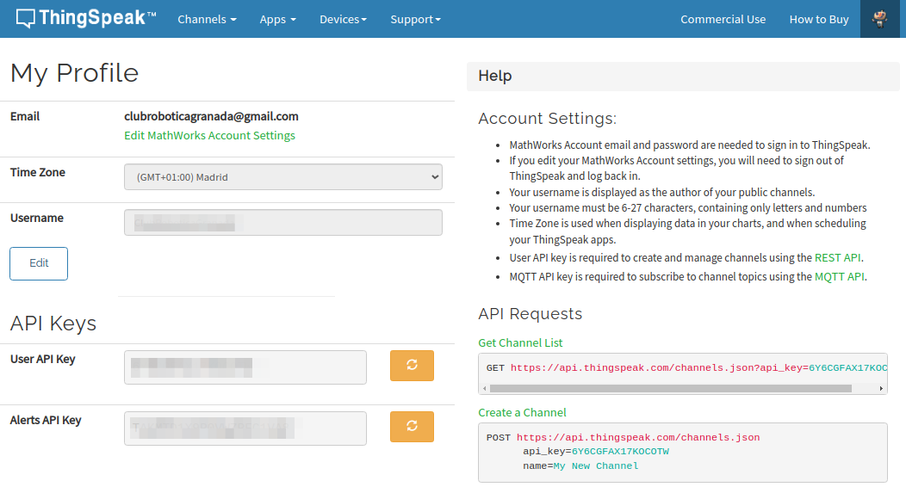 |

Si ahora nos dirigimos al menú "Channels" y escogemos "My Channels" entraremos en la página de creación de un canal. En la parte superior de la página es donde ponemos nombre al canal y establecemos los campos que vamos a usar, como ejemplo tenemos el de la imagen siguiente:

| Parte 1 de la creación de un canal |
|:|
| 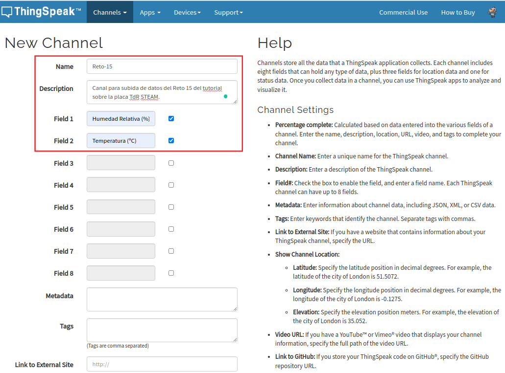 |

Si avanzamos hacía abajo en esta página podemos seguir cumplimentando datos de nuestro canal, como vemos en la imagen siguiente:

| Parte 2 de la creación de un canal |
|:|
| 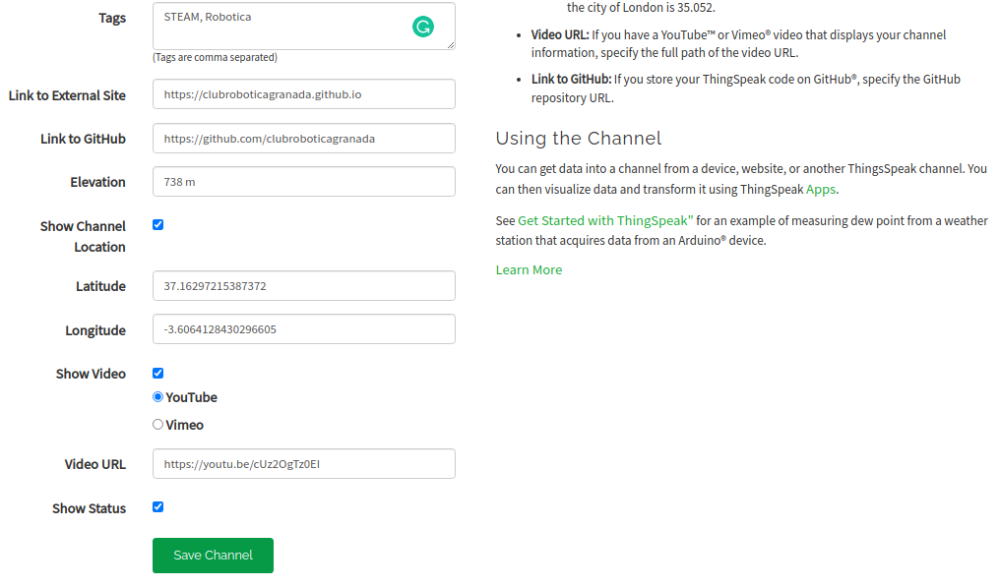 |

Activar la localización y poner las coordenadas hará que, posteriormente lo veremos, aparezca la localización puesta en un mapa. Algo similar sucede con el vídeo enlazado. Si damos a guardar se nos mostrará una pantalla similar a la siguiente, donde podemos ver los datos del canal Reto-15.

| Aspecto del canal recien creado |
|:|
| 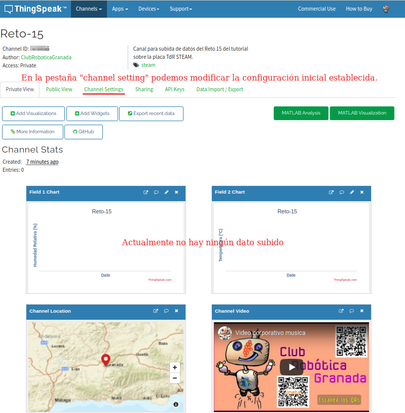 |

Como vemos este canal es privado y solamente se ha creado para mostrar las capturas que aquí se están mostrando y por lo tanto no será un canal accesible en el futuro.

En la pestaña “API Keys” vamos a tener disponibles los datos con los códigos identificativos para escribir en el canal y para leer el canal, tal y como vemos en la imagen siguiente. Estos datos los tendremos que usar posteriormente en ArduinoBlocks.

| API-Keys |
|:|
| 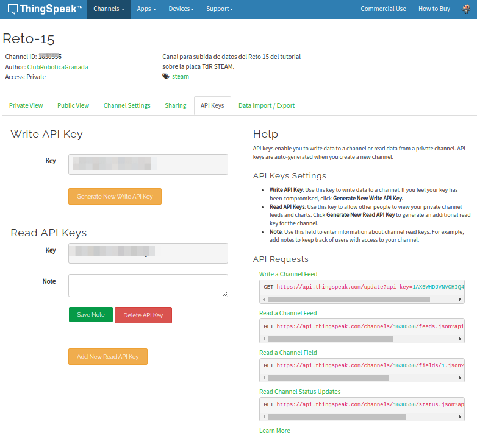 |

Con esto finalizamos la configuración de Thingspeak aunque hay otras muchas cosas que se pueden hacer con el broker.

### ArduinoBlocks
Una vez creado el canal en el broker ya estamos en condiciones de preparar el programa de ArduinoBlocks que envíe los datos del sensor DHT11 a la nube vía WiFi. Para ello en el bloque "Inicializar" tenemos que configurar los diferentes campos según vemos en la imagen siguiente:

| Configuración del bloque Inicializar |
|:|
| 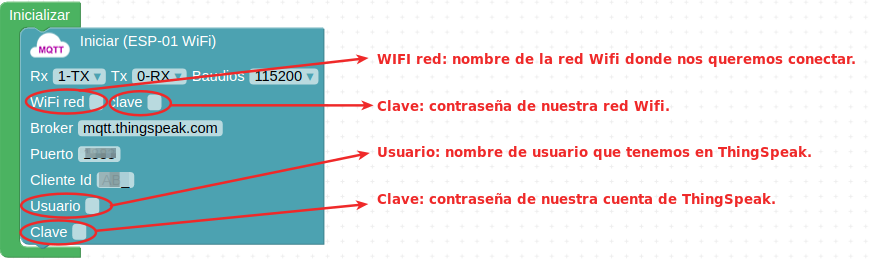 |

Una vez configurada la conexión vamos a implementar dos funciones una para leer los sensores y otra para subir los datos a la nube.

En la imagen siguiente vemos la programación de la función leer sensores, que lógicamente va a consistir en leer los datos de humedad y temperatura del sensor DHT11 y guardarlos en sendas variables.

| Función leer sensor DHT11 |
|:|
| 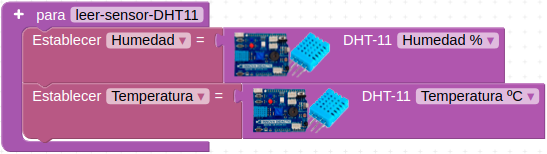 |

El bloque a utilizar lo encontramos en el menú MQTT de comunicaciones y tiene el aspecto de la imagen siguiente:

| Bloque para publicar en MQTT |
|:|
| 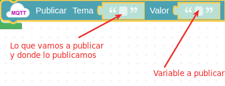 |

En tema debemos colocar el bloque "publicar" Thingspeak, que nos llevaría a tener el siguiente estado de programación:

| El bloque publicar de Thingspeak |
|:|
| 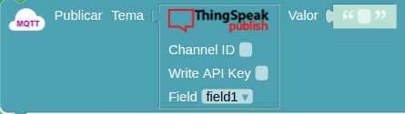 |

A continuación, configuraremos la publicación de los datos con la función subir datos a la nube y para ello debemos localizar:

* Channel ID: identificador de nuestro canal en ThingSpeak.
* Write API Key: contraseña de escritura o código para enviar los datos a ThingSpeak.

Estos datos los hemos de poner en cada bloque que pongamos de "Publicar Tema" y debemos hacer corresponder el campo Field de ArduinoBlocks con el de Thingspeak. En la imagen siguiente vemos el aspecto de la función subir-datos.

| Función subir datos |
|:|
| 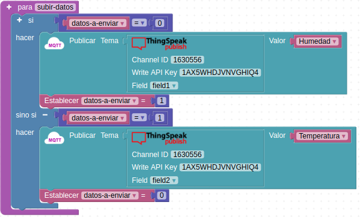 |

Lo único que resta para finalizar el programa es llamar a las funciones dentro del bucle. El aspecto final del programa lo vemos en la imagen siguiente:

| Programa del Reto 15 |
|:|
| 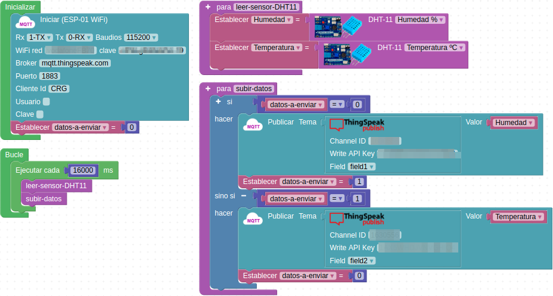 |

Cuando estamos trabajando con WiFi los bloques "Esperar" ya que durante la espera la conexión debe seguir realizando sus tareas y puede llegar el momento en que, si los usamos, la conexión se corte o moience a hacer cosas extrañas. Por eso es recomendable utilizar el bloque "Ejecutar cada" que vemos en la imagen anterior y evitar así posibles bloqueos en el micro. Es conveniente leer el apartado "Tiempo" [ArduinoBlocks - FreeBook](https://docs.google.com/document/u/1/d/e/2PACX-1vQSrOKHpbLQHVbGFdAvp7DcndoftoHDI20nvwGMaxu_7bGc1bUCmi4U6DZrJWRSudc2iXBg43QMuzCT/pub) así como su Anexo I: Bloques incompatibles con bloqueos de tiempo.

El bloque "Ejecutar cada" se establece a 16 segundos y esto es importante porque la versión gratuita de ThingSpeak sólo permite subir datos cada 15 segundos ([ThingSpeak™ Licensing FAQ](https://thingspeak.com/pages/license_faq)) y le damos un segundo mas porque justo los 15 segundos en alguna ocasión me ha generado algún problema. **¡Ya hemos configurado ArduinoBlocks!**

La programación del reto sin configurar los distintos campos está en el programa [Reto-15](http://www.arduinoblocks.com/web/project/655980).

### Visualización de datos

Una vez hecho esto ya podemos subir el programa a la placa y al cabo de unos segundos empezaremos a ver los primeros datos subidos en los dos campos del canal de ThingSpeak en la pestaña "Private View" de la web, tal y como muestra la imagen siguiente:

| Vista de Private View en la web de Thingspeak |
|:|
| 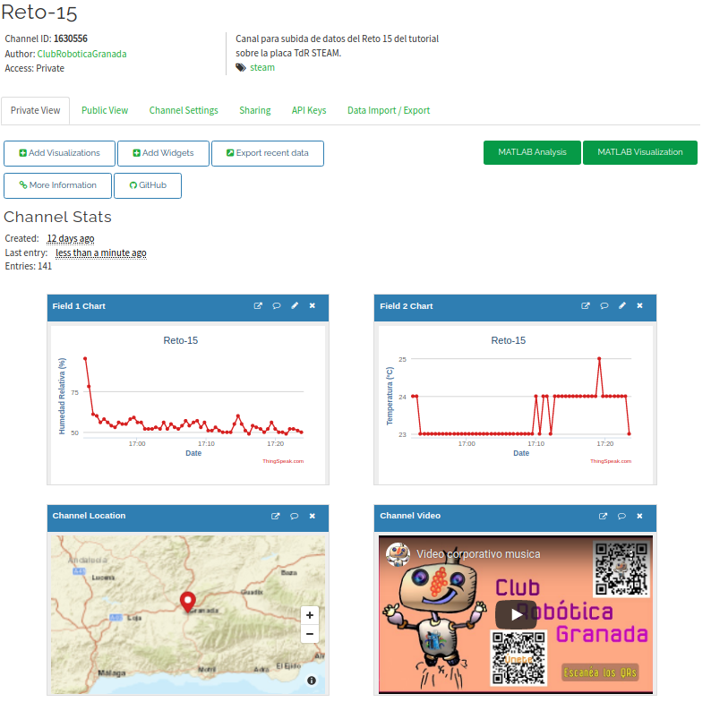 |

### Visualización de datos en smartphone o similar

MATLAB a través de su servidor (broker) Thingspeak ofrece varias aplicaciones para dispositivos smartphone. En la imagen siguiente vemos el resultado de una búsqueda en un dispositivo Android en Play Store.

| Thingspeak en Play Store |
|:|
| 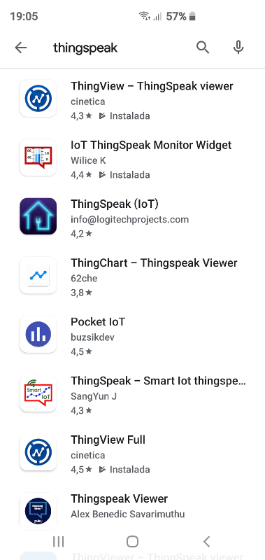 |

Nos centraremos en las dos destacadas en la imagen anterior.

* **ThingView**
Una vez instalada la App en nuestro smartphone podemos añadir los canales que deseemos, simplemente haciendo clic sobre el signo más y dando el identificador del canal. En la imagen siguiente observamos el canal del Reto 15 creado para este caso.

| ThingView con canal agregado |
|:|
| 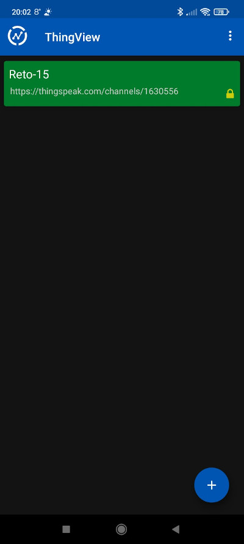 |

En esta otra imagen vemos la visualización de datos del canal en ThingView.

| Visulizando datos en ThingView |
|:|
| 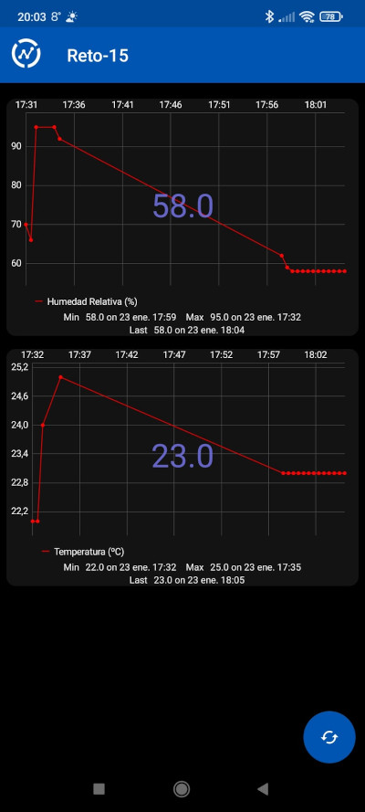 |

## Actividades de ampliación

**R15.A1**: (No solucionada) Estudiar la funcionalidad de las pestañas y botones que se ven en la imagen siguiente y probar, realizando una memoria al estilo de los retos de este tutorial, al menos sobre los tres destacados.

| Actividad 1 del reto 15 |
|:|
| 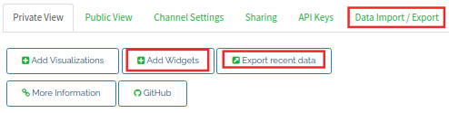 |

**R15.A2**: (No solucionada) Instalar la aplicación ThingView y realizar la visualización de datos de al menos un canal creado para esta actividad.

**R15.A3:Widget**: (No solucionada) La segunda opción de descarga es una microaplicación widget para la pantalla de nuestro móvil que nos va a permitir estar viendo dos de las variables que tengamos en nuestro canal. En este caso, además del número de canal debemos conocer la API key de lectura. El widget permite establecer alarmas cuando se superan, por encima o por abajo, los valores de la variable establecidos. Añadir el widget al smartphone y experimentar sus diferentes opciones.
