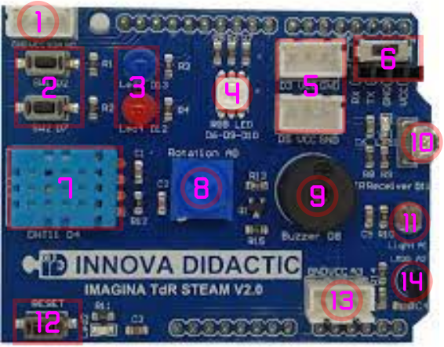

# Hardware TdR STEAM

La tabla siguiente es una descripción del hardware TdR-STEAM.

| Imagen |
|:|
|  |

| N | Sensor, actuador o dispositivo externo | Pin de conexión |
|:|---|:|
| 1 | Interface I2C o IIC | SDA-A4 y SCL-A5 |
| 2 | Pulsadores SW1 y SW2 | D2 y D7 |
| 3 | Diodos LED Azul (LED3) y Rojo (LED4) | D13 y D12 |
| 4 | Led RGB o neopixel | D6, D9 y D10 |
| 5 | Dos conectores para Entradas/Salidas digitales | D3 y D5 |
| 6 | Conector de comunicaciones Bluetooth y WiFi (Swich On/Off) | Rx y Tx |
| 7 | Sensor de Temperatura y Humedad DHT11 | D4 |
| 8 | Potenciómetro giratorio de 270º | A0 |
| 9 | Zumbador Piezoeléctrico o buzzer | D8 |
| 10 | Diodo receptor de infrarrojos (IR) | D11 |
| 11 | Sensor de luminosidad (LDR) | A1 |
| 12 | Botón de Reset | -- |
| 13 | Conector para entrada analógica | A3 |
| 14 | Sensor de temperatura (LM35) | A2 |

En la tabla siguiente se establece la relación entre los elementos de la placa TdR STEAM y las conexiones de una placa UNO.

| Pin UNO | Uso en TdR STEAM | Descripción |
|:|---|---|
| D0 | Rx | Pin de recepción Bluetooth y WiFi |
| D1 | Tx | Pin de transmisión Bluetooth y WiFi |
| D2 | Pulsador SW1 | Entrada digital |
| D3 | Conector para entrada/salida digital externa | Entrada/salida digital |
| D4 | Sensor de Temperatura y Humedad DHT11 | Entrada digital |
| D5 | Conector para entrada/salida digital externa | Entrada/salida digital |
| D6 | Color rojo del LED RGB | Salida digital |
| D7 | Pulsador SW2 | Entrada digital |
| D8 | Zumbador o buzzer | Salida digital |
| D9 | Color verde del LED RGB | Salida digital |
| D10 | Color azul del LED RGB | Salida digital |
| D11 | Sensor IR | Entrada digital |
| D12 | LED rojo | Salida digital |
| D13 | LED azul | Salida digital |
| A0 | Potenciómetro | Entrada analógica |
| A1 | Sensor de luz (LDR) | Entrada analógica |
| A2 | Sensor de temperatura (LM35) | Entrada analógica |
| A3 | Conector para entrada analógica externa | Entrada analógica |
| A4 | SDA (Serial DAta.) | Datos I2C |
| A5 | SCL (Serial CLock) | Señal de reloj I2C |

