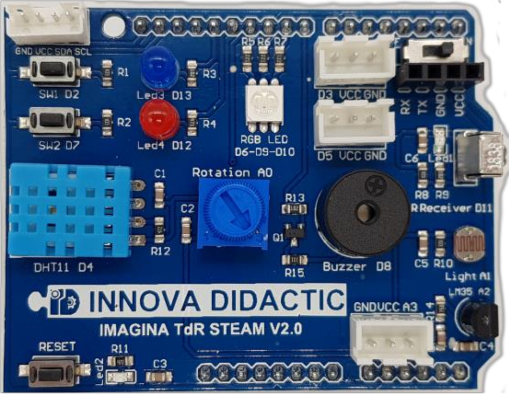
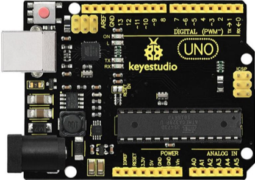
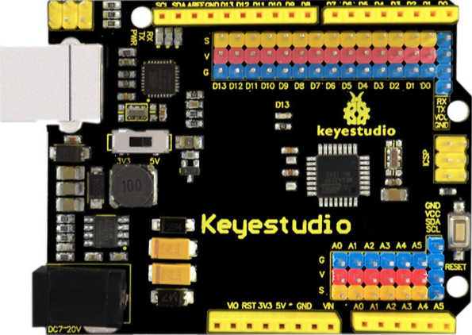
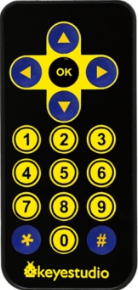
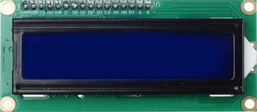
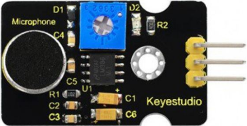

# Retos con TdR STEAM y UNO

## Lo que vamos a necesitar

### Software
Para llevar a cabo la **programación** de los **retos** es necesario estar registrado en **ArduinoBlocks** y se recomienda hacerlo con el nombre real para posteriormente facilitar la localización si es necesaria.

* La tarea es sencilla y está perfectamente descrita en el Free Book (online & updated) que podemos encontrar en los recursos de la plataforma www.arduinoblocks.com.
* Creamos un "nuevo usuario" utilizando para ello una cuenta de correo válida donde vamos a recibir un correo de confirmación para activarla.
* Ya estamos en condiciones de crear nuestros propios proyectos en la plataforma como veremos mas adelante.

| Crear un nuevo proyecto |
|:|
|  |

* Descarga e instala en tu ordenador y para tu sistema operativo [ArduinoBlocks - Connector](http://www.arduinoblocks.com/web/site/abconnector5). Este programa vamos a necesitarlo para poder comunicar nuestra placa con la plataforma a través del puerto USB de nuestro ordenador.

### Hardware imprescindible
Una placa Imagina TdR STEAM versión 2.0 como la de la imagen siguiente:

| Shield TdR-STEAM V2.0 |
|:|
|  |

Una placa tipo Arduino UNO R3, o bien alguna de las desarrolladas por ser hardware libre como estas de [Keyestudio](https://www.keyestudio.com/).

| Ks0341 - Placa avanzada Keyestudio UNO Compatible | Ks0172 - Placa Keyestudio UNO con conectores de 3 pines |
|:|:|
|  |  |

### Hardware recomendado
A continuación exponemos el material adicional que vamos a emplear en esta colección de retos que no es otro que el incluido en el [Kit Imagina TdR STEAM](https://shop.innovadidactic.com/es/para-centros-educativos/1445-kit-imagina-tdr-steam-basado-en-arduino.html) comercializado por la empresa [INNOVA DIDACTIC](https://shop.innovadidactic.com/es/).

* Mando de control remoto por infrarojos para utilizar en conjunto con el sensor de infrarojos integrado en la placa TdR-STEAM.

| Mando a distancia por IR |
|:|
|  |

* Pantalla LCD 1602 IIC (I2C) de 2 línea de 16 caracteres. Nos va a permitir mostrar mensajes de texto e irá conectada al conector I2C de la placa TdR-STEAM.

| LCD 1602 I2C |
|:|
|  |

* Sensor de sonido analógico (con potenciometro). Se utiliza básicamente para detectar el nivel sonoro ambiental. El potenciometro permite ajustar el nivel de ganancia.

| Sensor de sonido analógico |
|:|
|  |

